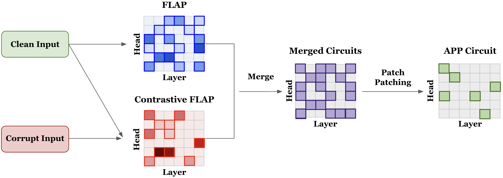
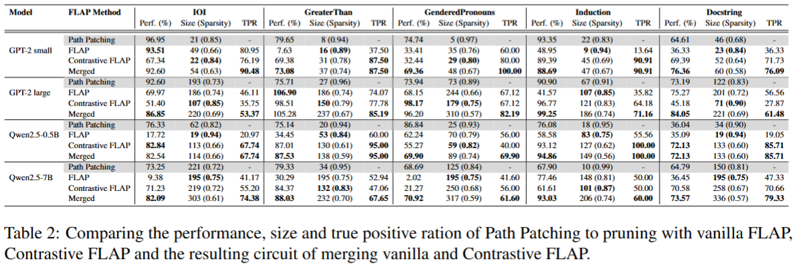
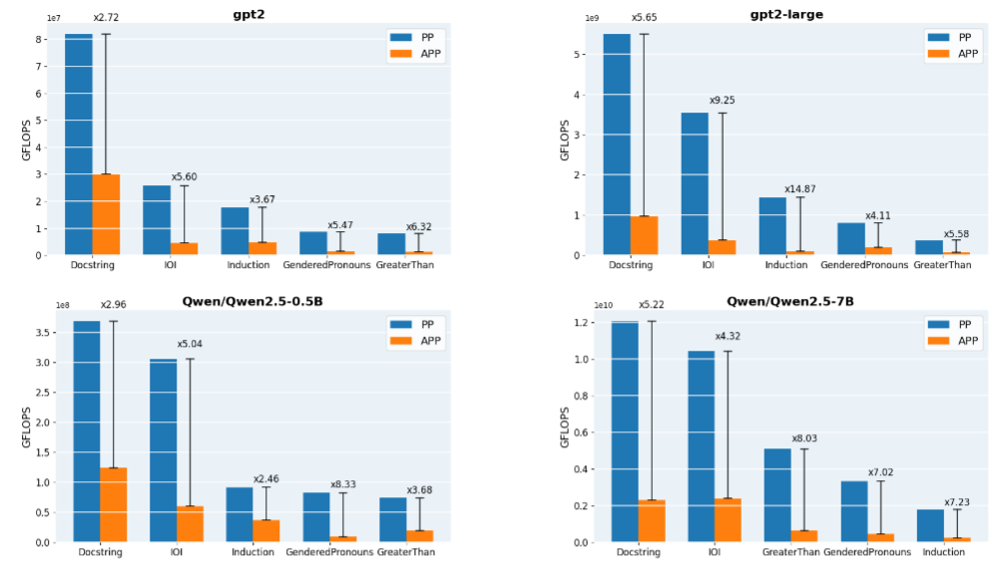

# AcceleratedPathPatching

## Introduction
Accelerated Path Patching (APP) efficently automitizes circuit discovery by reducing the search space for path patching with the help of pruning algorithms. To include as many task-critical heads as possible, FLAP, a zero-shot pruning algorithm, is adapted to assign higher pruning scores to these heads. 



### Advantages of APP
* Benefits from the **high efficency** of FLAP
* Benefits from the **high accuracy** of Path Patching 
* Pruning filters out irrelevant heads at an earlier stage, resulting in **sparser circuits** for larger models

### Supported LLMs
* GPT-2
* Qwen2.5 

### Supported Tasks
* IOI
* Greater Than
* Induction
* GenderedPronouns
* Docstring

## Table of Content
- [Quick Start](#start)
- [Configuration Instruction](#config)
- [Accelerated Path Patching](#APP)

## Quick Start
**It is necessary to run Pruning before APP to provide a circuit!**

## Automatic Path Patching
This scripts runs the automated path patching algorithm for the GPT-2 small model on the IOI task and extracts a circuit with 21 heads. 

```bash scripts/gpt2-pp.sh```

## Pruning
```bash scripts/gpt2-FLAP.sh```

## Accelerated Path Patching (APP)
```bask scripts/gpt2-APP.sh```


## Configuration Instruction
### Automatic Patching
Automatic path patching and accelerated path patching can be run by the same file. For APP, a pruning circuits has to be calculated before and be saved at `out_path`, such that it can be loaded for APP. 

```
python Patching/automated_PP.py \
    --model_name=gpt2 \
    --task=IOI  \
    --metric=logits_diff \
    --pruning_circuit=none \
    --importance_threshold=2 \
    --min_value_threshold=0.02 \
    --calc_FLOPS \
    --save_every_x_steps=100 \
    --out_path=results/ \
    --cache_dir=llm_weights \
```

Arguments:
- `model_name`: Identifier of the model to download the model via `HookedTransformer.from_pretrained` or `AutoModelForCausalLM.from_pretrained` from the Huggingface hub.
- `task`: Identifier of a natural language task. Implemented tasks are `IOI`, `GreaterThan`, `Induction`, `GenderedPronouns`, `Docstring`.
- `metric`: Metric to measure the influence of patching heads. Usually the average logit difference (`logits_diff`) is utilized, but probability difference (`prob_diff`) and KL divergence are suppoorted (`kl_divergence`).
- `pruning_circuit`: Reduce the search space for path patching to the given circuit. `none` for regular path patching, `vanilla` for vanilla FLAP, `contrastive` for contrastive FLAP and `hybrid` for hybrid FLAP
- `importance_threshold`: A head is added to the circuit, if its score is at least `importance_threshold` * SD(all_scores)
- `min_value_threshold`: If none of all scores in the current patching iteration has a value bigger than `min_value_threshold`, no head is added to the circuit.
- `calc_FLOPS`: Calculate the FLOPS during path patching.
- `save_every_x_steps`: Especially usefull, when patching large models. Intermediate results are saved every x steps. 
- `out_path`: Directory to store the results at. 
- `cache_dir`: Directory to cache the model at.


### Pruning
```srun python3 /home/eickhoff/esx670/OverlapMetric/Pruning/FLAP/lib/FLAP.py \
    --model_name=gpt2 \
    --task=IOI \
    --contrastive_FLAP \
    --cliff_point=first \
    --highest_sparsity=99 \
    --lowest_sparsity=60 \ 
    --step_size=1 \
    --metrics=WIFN \
    --structure=AL-AM \
    --calc_FLOPS \
    --cache_dir=llm_weights/  \
    --out_path=results \
```

- `model_name`: Identifier of the model to download the model via `HookedTransformer.from_pretrained` or `AutoModelForCausalLM.from_pretrained` from the Huggingface hub.
- `task`: Identifier of a natural language task. Implemented tasks are `IOI`, `GreaterThan`, `Induction`, `GenderedPronouns`, `Docstring`.
- `contrastive_FLAP`: If true, run contrastive FLAP instead of regular FLAP. For contrastive FLAP the pruning scores are the difference between between pruning scores obtained under the clean and corrupted input. 
- `cliff_point`: Three cliff point calculations are supported [`first`, `biggest`, `fixed`]. Cliff points are identified by observing drops in the performance curve. 
- `highest_sparsity`: max sparsity under which performance is evaluated. Default is 99.
- `lowest_sparsity`: min sparsity under which performance is evaluated. Default is 60.
- `step_size`: Step size to get from the lowest to the highest sparsity. Default is 1.
- `metrics`: Pruning metrics provided by FLAP [`IFV`, `WIFV`, `WIFN`, `N/A`]. Default is WIFV.
- `structure`: Pruning structure provided by FLAP. We only ever use `AL-AM` as it is a global and adpative pruning structure.
- `calc_FLOPS`: Calculate the FLOPS during path patching.
- `save_every_x_steps`: Especially usefull, when patching large models. Intermediate results are saved every x steps. 
- `out_path`: Directory to store the results at. 
- `cache_dir`: Directory to cache the model at.

## Accelerated Path Patching
### Accuracy


### Efficency


## Citation